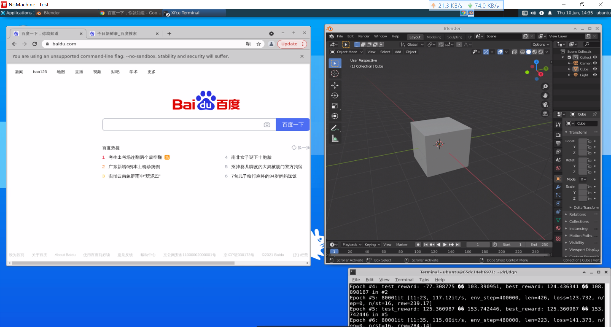

# Ubuntu Desktop via Docker

A Dockerized Ubuntu desktop environment with SSH and remote VNC access capabilities. This project provides a way to run a Ubuntu desktop in a container, accessible both via SSH or a web-based remote desktop interface.

## Prerequisites

### System Requirements

- A machine with Docker installed
- Basic understanding of Docker commands and container management

### Required Tools

- [Docker](https://www.docker.com) (version 20.10 or later)

## Getting Started

### Step-by-Step Installation

#### 1. Pull the Docker Image

```bash
docker pull oluiscabral/ubuntu-desktop
```

#### 2. Run the Container

Create a new container with the following command:

```bash
docker run -d --restart=on-failure \
    -e REMOTE_USER=myuser \
    -e REMOTE_PASS=mypassword \
    -p 10022:22 \
    -p 14000:4000 \
    oluiscabral/ubuntu-desktop
```

### Accessing the Container

#### SSH Access

Use the following command to connect via SSH:

```bash
ssh myuser@<host-ip> -p 10022
```

- **Default Credentials**:
  - Username: `myuser`
  - Password: `mypassword`

#### Remote Desktop (KasmVNC) Access

Access the remote desktop interface using your browser:

```
https://<host-ip>:14000
```

> **Note**: Chrome is recommended for optimal performance.

## Advanced Configuration

### Custom User Arguments

You can customize the container behavior by setting environment variables during container creation.

#### Available Options

- `VNC_THREADS`: Specifies the number of threads for VNC server (default: 2). Set to `0` for automatic detection.
- `HTTPS_CERT`: Path to an SSL PEM certificate file for enabling HTTPS on the KasmVNC server.
- `HTTPS_CERT_KEY`: Path to the corresponding SSL key file.

**Example with Custom Certificates**

```bash
docker run -d --restart=on-failure \
    -e REMOTE_USER=myuser \
    -e REMOTE_PASS=mypassword \
    -e HTTPS_CERT=/path/to/cert.pem \
    -e HTTPS_CERT_KEY=/path/to/key.pem \
    -p 10022:22 \
    -p 14000:4000 \
    oluiscabral/ubuntu-desktop
```

### SSH Configuration

You can customize the SSH service by modifying the default port or credentials.

**Example with Custom Port**

```bash
docker run -d --restart=on-failure \
    -e REMOTE_USER=myuser \
    -e REMOTE_PASS=mypassword \
    -p 2222:22 \
    oluiscabral/ubuntu-desktop
```

## Building the Image

To build the image from source:

```bash
git clone https://github.com/oluiscabral/containerized-ubuntu-desktop.git
cd containerized-ubuntu-desktop
docker build -t ubuntu-desktop -f src/Dockerfile .
```

> **Note**: Make sure you have all required dependencies installed before building.

---

**Contact**: For questions or feedback, reach out to [oluiscabral@hotmail.com.com](mailto:oluiscabral@hotmail.com)
